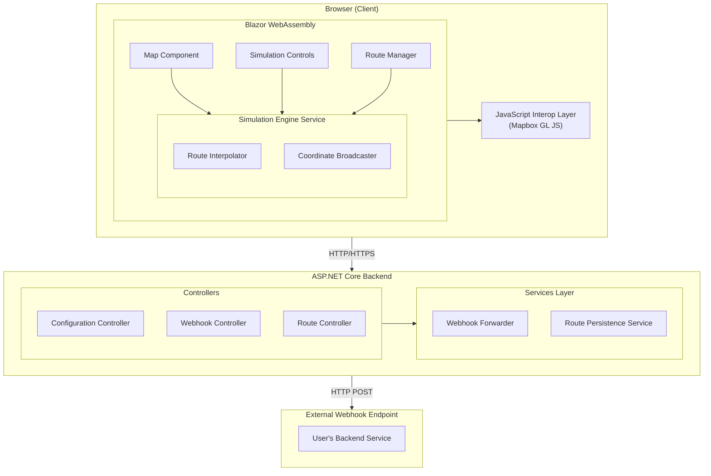
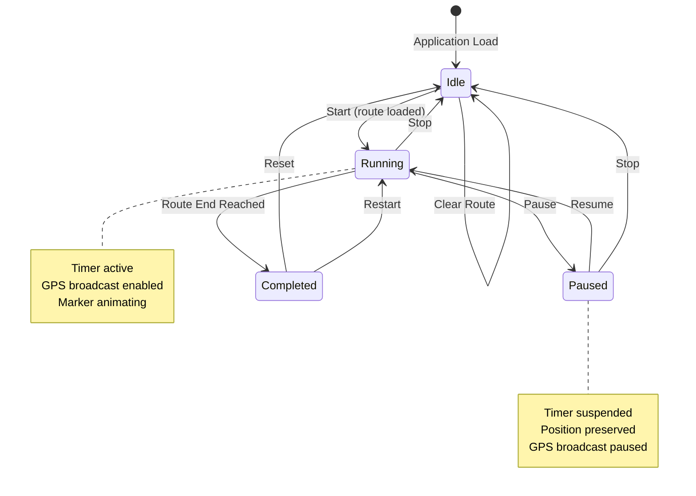
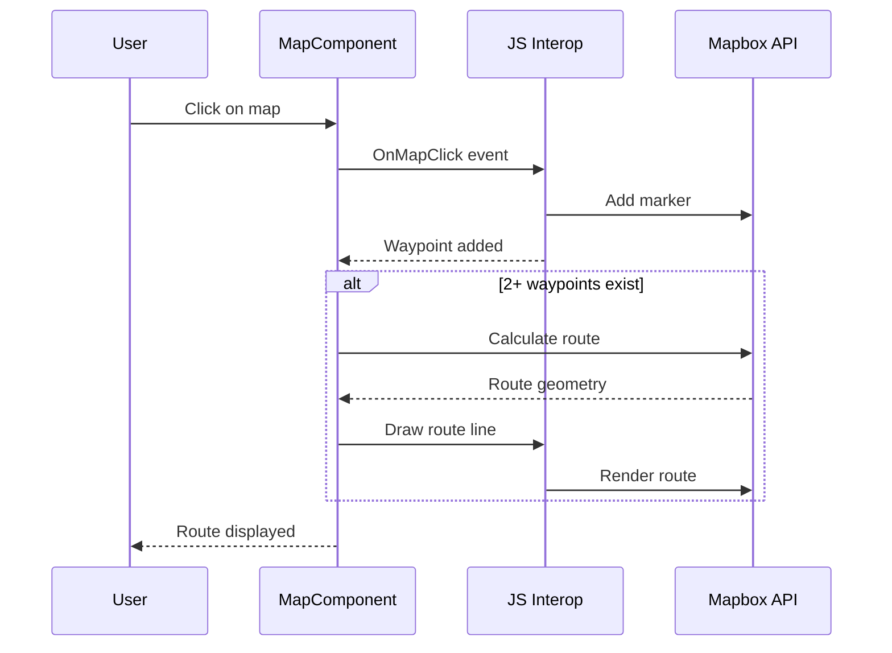
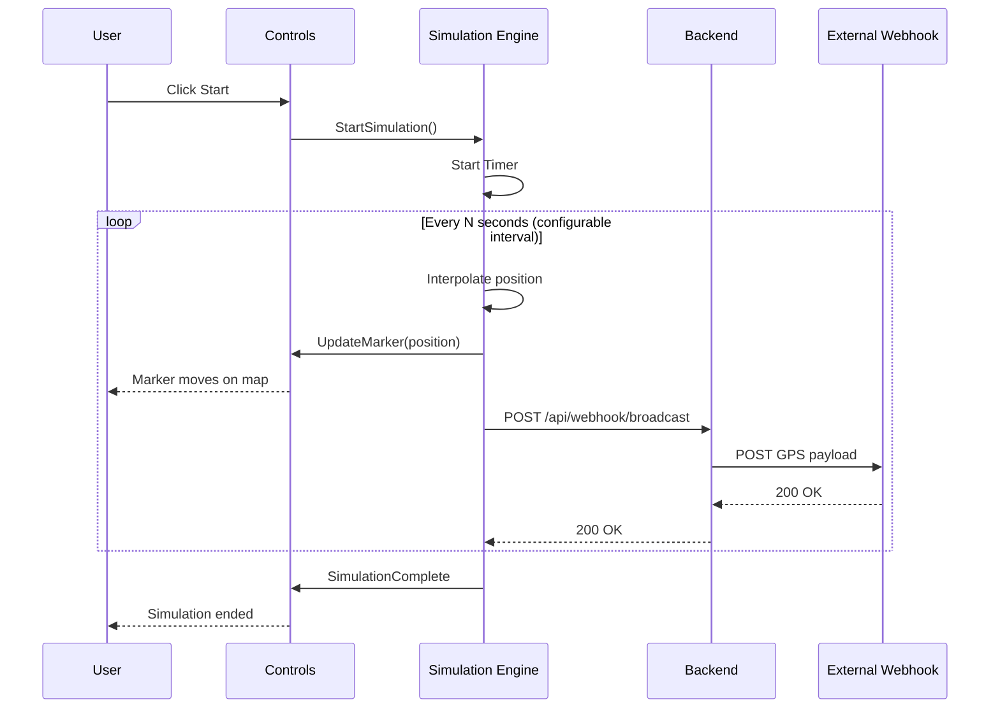
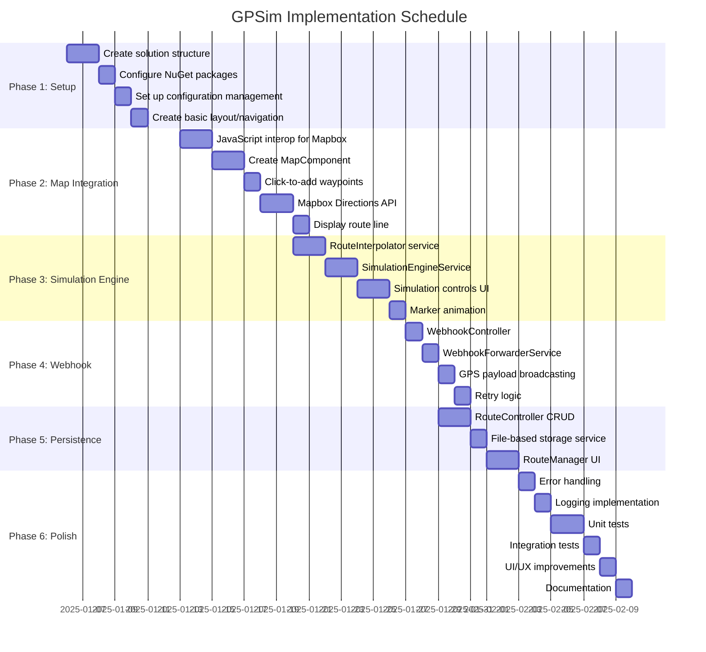

# GPSim - GPS Driver Simulator

## Design Document

**Version:** 1.0  
**Date:** November 26, 2025  
**Author:** System Architect

---

## 1. Overview

GPSim is a web-based GPS driver simulation application that allows users to:
- Plot driving routes on an interactive Mapbox map
- Simulate a driver moving along the route at configurable intervals
- Broadcast GPS coordinates to an external webhook endpoint in real-time
- Save and load simulation configurations for later use

### Scope

**In Scope:**
- Interactive map with route plotting using Mapbox GL JS
- Marker animation along plotted routes
- Configurable simulation intervals (1-60 seconds)
- Webhook integration for GPS coordinate broadcasting
- Route persistence (save/load functionality)
- Playback controls (start, stop, pause, resume)

**Out of Scope:**
- User authentication/authorization
- Multi-user collaboration
- Historical simulation replay analytics
- Mobile native applications

---

## 2. Background

### Problem Statement
Testing GPS-based backend services requires realistic GPS coordinate data. Manual testing with real devices is time-consuming and impractical for development workflows. A simulation tool that can generate realistic GPS movement patterns along defined routes provides a more efficient development and testing experience.

### Existing Solutions
- Physical GPS devices - Expensive, time-consuming
- Static coordinate uploads - Not realistic for movement simulation
- Third-party simulators - Often not customizable or require subscriptions

### Dependencies
- **Mapbox GL JS** - Map rendering and directions API
- **Mapbox Directions API** - Route calculation between waypoints
- **.NET 9.0** - Runtime environment
- **Blazor WebAssembly** - Frontend framework

---

## 3. Goals & Non-Goals

### Goals
1. Provide an intuitive interface for plotting driving routes
2. Accurately simulate GPS coordinates along a route with configurable timing
3. Reliably deliver GPS coordinates to external webhook endpoints
4. Enable saving and loading of simulation configurations
5. Support variable simulation speeds (1-60 second intervals)

### Non-Goals
1. Simulate real-world GPS signal variations (jitter, accuracy loss)
2. Support for non-driving routes (walking, cycling, transit)
3. Multi-route simultaneous simulation
4. Real-time collaboration features

---

## 4. Requirements

### 4.1 Functional Requirements

| ID | Requirement | Priority |
|----|-------------|----------|
| FR-01 | User can view an interactive Mapbox map | Must |
| FR-02 | User can click on map to add waypoints for route | Must |
| FR-03 | System calculates driving route through waypoints using Mapbox Directions API | Must |
| FR-04 | User can start/stop/pause simulation | Must |
| FR-05 | Marker moves along route at configured interval | Must |
| FR-06 | GPS coordinates sent to webhook at each interval | Must |
| FR-07 | User can configure simulation interval (1-60 seconds) | Must |
| FR-08 | User can save simulation routes to file | Must |
| FR-09 | User can load previously saved routes | Must |
| FR-10 | User can clear current route and start over | Should |
| FR-11 | User can drag waypoints to adjust route | Should |
| FR-12 | Display current speed and heading in UI | Could |

### 4.2 Non-Functional Requirements

| ID | Requirement | Target |
|----|-------------|--------|
| NFR-01 | Page load time | < 3 seconds |
| NFR-02 | Webhook delivery latency | < 500ms |
| NFR-03 | Browser support | Chrome, Firefox, Edge (latest) |
| NFR-04 | Map responsiveness | 60 FPS during animation |

### 4.3 Security Requirements

| ID | Requirement |
|----|-------------|
| SR-01 | Mapbox access token stored in server configuration, not exposed in client |
| SR-02 | Webhook URL configurable via server-side appsettings.json |
| SR-03 | No authentication required for webhook calls (per requirements) |

---

## 5. Proposed Solution

### 5.1 Architecture Overview



### 5.2 Component Details

#### 5.2.1 Frontend Components (Blazor WebAssembly)

**MapComponent**
- Wraps Mapbox GL JS via JavaScript interop
- Handles map initialization with configured access token
- Manages markers, route lines, and click events
- Provides methods: `AddWaypoint()`, `UpdateMarkerPosition()`, `DrawRoute()`

**SimulationControls**
- Start/Stop/Pause buttons
- Interval slider (1-60 seconds)
- Current position display (lat/lng)
- Speed and heading indicators

**RouteManager**
- Save route button (downloads JSON file)
- Load route button (file picker)
- Clear route button
- Route name input field

**SimulationEngineService**
- Manages simulation state (Idle, Running, Paused)
- Timer-based position updates
- Coordinates with RouteInterpolator and CoordinateBroadcaster

#### Simulation State Machine



#### 5.2.2 Backend Components (ASP.NET Core)

**ConfigurationController**
- `GET /api/config/mapbox` - Returns Mapbox access token for client

**WebhookController**
- `POST /api/webhook/broadcast` - Receives GPS data from client, forwards to external webhook

**RouteController**
- `POST /api/routes` - Save route configuration
- `GET /api/routes` - List saved routes
- `GET /api/routes/{id}` - Get specific route
- `DELETE /api/routes/{id}` - Delete route

### 5.3 Data Models

```csharp
/// <summary>
/// Represents a complete simulation route configuration
/// </summary>
public record SimulationRoute
{
    public Guid Id { get; init; }
    public string Name { get; init; } = string.Empty;
    public List<Coordinate> Waypoints { get; init; } = new();
    public RouteGeometry? Geometry { get; init; }
    public SimulationSettings Settings { get; init; } = new();
    public DateTime CreatedAt { get; init; }
    public DateTime? LastModifiedAt { get; init; }
}

/// <summary>
/// Geographic coordinate with latitude and longitude
/// </summary>
public record Coordinate(double Latitude, double Longitude);

/// <summary>
/// Route geometry from Mapbox Directions API
/// </summary>
public record RouteGeometry
{
    public string Type { get; init; } = "LineString";
    public List<double[]> Coordinates { get; init; } = new();
    public double DistanceMeters { get; init; }
    public double DurationSeconds { get; init; }
}

/// <summary>
/// Simulation configuration settings
/// </summary>
public record SimulationSettings
{
    public int IntervalSeconds { get; init; } = 5;
    public string? WebhookUrlOverride { get; init; }
}

/// <summary>
/// GPS payload sent to webhook endpoint
/// </summary>
public record GpsPayload
{
    public double Latitude { get; init; }
    public double Longitude { get; init; }
    public DateTime Timestamp { get; init; }
    public double? SpeedMps { get; init; }
    public double? HeadingDegrees { get; init; }
    public Guid SimulationId { get; init; }
    public int SequenceNumber { get; init; }
}

/// <summary>
/// Simulation state enumeration
/// </summary>
public enum SimulationState
{
    Idle,
    Running,
    Paused,
    Completed
}
```

### 5.4 Configuration

**appsettings.json**
```json
{
  "Logging": {
    "LogLevel": {
      "Default": "Information",
      "Microsoft.AspNetCore": "Warning"
    }
  },
  "AllowedHosts": "*",
  "Mapbox": {
    "AccessToken": "pk.your_mapbox_access_token_here"
  },
  "Webhook": {
    "DefaultUrl": "https://your-backend-service.com/api/gps",
    "TimeoutSeconds": 30,
    "RetryCount": 3
  },
  "Storage": {
    "RoutesDirectory": "Data/Routes"
  }
}
```

### 5.5 Sequence Diagrams

#### Route Creation Flow



#### Simulation Execution Flow



### 5.6 Route Interpolation Algorithm

The route interpolation follows these steps:

1. **Calculate Total Distance**: Sum all segment distances from Mapbox route geometry
2. **Determine Progress**: Based on elapsed time and total duration, calculate percentage complete
3. **Find Segment**: Locate which route segment contains the current position
4. **Interpolate Within Segment**: Linear interpolation between segment start and end points

```csharp
public Coordinate InterpolatePosition(RouteGeometry route, double progressPercent)
{
    var totalDistance = route.DistanceMeters;
    var targetDistance = totalDistance * (progressPercent / 100.0);
    
    var accumulatedDistance = 0.0;
    
    for (int i = 0; i < route.Coordinates.Count - 1; i++)
    {
        var segmentStart = route.Coordinates[i];
        var segmentEnd = route.Coordinates[i + 1];
        var segmentLength = CalculateDistance(segmentStart, segmentEnd);
        
        if (accumulatedDistance + segmentLength >= targetDistance)
        {
            var segmentProgress = (targetDistance - accumulatedDistance) / segmentLength;
            return LinearInterpolate(segmentStart, segmentEnd, segmentProgress);
        }
        
        accumulatedDistance += segmentLength;
    }
    
    // Return last point if at end
    var lastPoint = route.Coordinates[^1];
    return new Coordinate(lastPoint[1], lastPoint[0]);
}
```

---

## 6. Alternatives Considered

### 6.1 React/TypeScript Frontend

**Pros:**
- Native JavaScript for Mapbox GL JS integration
- Larger ecosystem of map-related libraries

**Cons:**
- Requires separate frontend build tooling
- Different language from backend (violates single-stack preference)
- Additional complexity in project structure

**Decision:** Rejected in favor of Blazor WebAssembly to maintain C# throughout the stack.

### 6.2 Server-Side Blazor

**Pros:**
- Simpler deployment (no WASM download)
- Full .NET runtime capabilities

**Cons:**
- Requires constant SignalR connection
- Higher server resource usage
- Latency for map interactions

**Decision:** Rejected due to interactive map performance requirements.

### 6.3 Direct Webhook Calls from Client

**Pros:**
- Simpler architecture (no backend relay)
- Lower latency

**Cons:**
- Exposes webhook URL to client
- CORS complications with external endpoints
- No server-side logging/monitoring

**Decision:** Rejected for security and observability reasons.

---

## 7. Risks & Mitigations

| Risk | Impact | Likelihood | Mitigation |
|------|--------|------------|------------|
| Mapbox API rate limiting | High | Medium | Implement client-side caching of routes; batch direction requests |
| Webhook endpoint unavailable | Medium | Medium | Implement retry logic with exponential backoff; queue failed requests |
| Browser tab throttling during simulation | Medium | High | Use Web Workers for timer; warn users about tab visibility |
| Large route files causing performance issues | Low | Low | Implement route simplification; limit waypoint count |
| Mapbox token exposure | High | Low | Serve token via backend API; implement token rotation |

---

## 8. Implementation Plan

### Implementation Timeline



### Phase Details

| Phase | Tasks | Duration |
|-------|-------|----------|
| **Phase 1: Project Setup** | Create solution structure, configure packages, setup configuration, basic layout | Week 1 |
| **Phase 2: Map Integration** | JavaScript interop, MapComponent, waypoints, Directions API, route display | Week 1-2 |
| **Phase 3: Simulation Engine** | RouteInterpolator, SimulationEngineService, controls UI, marker animation | Week 2-3 |
| **Phase 4: Webhook Integration** | WebhookController, WebhookForwarderService, GPS broadcasting, retry logic | Week 3 |
| **Phase 5: Persistence** | RouteController CRUD, file storage service, RouteManager UI | Week 3-4 |
| **Phase 6: Polish & Testing** | Error handling, logging, unit/integration tests, UI/UX, documentation | Week 4 |

---

## 9. Testing & Validation

### 9.1 Unit Tests
- Route interpolation algorithm accuracy
- Simulation state machine transitions
- GPS payload serialization
- Configuration parsing

### 9.2 Integration Tests
- Mapbox API integration
- Webhook forwarding end-to-end
- Route persistence operations

### 9.3 Manual Testing
- Cross-browser compatibility (Chrome, Firefox, Edge)
- Various route lengths and complexity
- Network failure scenarios
- Tab visibility/throttling behavior

### 9.4 Performance Benchmarks
- Marker animation smoothness at various intervals
- Webhook delivery latency
- Page load time with large saved routes

---

## 10. Open Questions

1. **Route Optimization**: Should we support "optimize waypoint order" feature for multi-stop routes?
2. **Offline Support**: Should saved routes work offline (cached map tiles)?
3. **Simulation Speed Multiplier**: Beyond interval adjustment, should we support "fast forward" (e.g., 10x speed)?
4. **GPS Accuracy Simulation**: Should we add optional random jitter to simulate real GPS accuracy variations?
5. **Multiple Vehicles**: Future support for simulating multiple vehicles simultaneously?

---

## 11. References

- [Mapbox GL JS Documentation](https://docs.mapbox.com/mapbox-gl-js/)
- [Mapbox Directions API](https://docs.mapbox.com/api/navigation/directions/)
- [Blazor WebAssembly Documentation](https://learn.microsoft.com/en-us/aspnet/core/blazor/)
- [ASP.NET Core Web API](https://learn.microsoft.com/en-us/aspnet/core/web-api/)
- [GeoJSON Specification](https://geojson.org/)

---

## Appendix A: Project Structure

```
GPSim/
├── src/
│   ├── GPSim.Client/                    # Blazor WebAssembly
│   │   ├── wwwroot/
│   │   │   ├── css/
│   │   │   ├── js/
│   │   │   │   └── mapbox-interop.js
│   │   │   └── index.html
│   │   ├── Components/
│   │   │   ├── Map/
│   │   │   │   └── MapComponent.razor
│   │   │   ├── Simulation/
│   │   │   │   └── SimulationControls.razor
│   │   │   └── Routes/
│   │   │       └── RouteManager.razor
│   │   ├── Services/
│   │   │   ├── MapboxInteropService.cs
│   │   │   ├── SimulationEngineService.cs
│   │   │   └── RouteInterpolatorService.cs
│   │   ├── Pages/
│   │   │   └── Simulator.razor
│   │   └── Program.cs
│   │
│   ├── GPSim.Server/                    # ASP.NET Core Backend
│   │   ├── Controllers/
│   │   │   ├── ConfigurationController.cs
│   │   │   ├── WebhookController.cs
│   │   │   └── RoutesController.cs
│   │   ├── Services/
│   │   │   ├── WebhookForwarderService.cs
│   │   │   └── RoutePersistenceService.cs
│   │   ├── appsettings.json
│   │   └── Program.cs
│   │
│   └── GPSim.Shared/                    # Shared Models
│       ├── Models/
│       │   ├── SimulationRoute.cs
│       │   ├── Coordinate.cs
│       │   ├── GpsPayload.cs
│       │   └── SimulationSettings.cs
│       └── GPSim.Shared.csproj
│
├── tests/
│   ├── GPSim.Client.Tests/
│   └── GPSim.Server.Tests/
│
├── .docs/
│   └── design.md
│
├── GPSim.sln
├── README.md
├── Dockerfile
└── docker-compose.yml
```

---

## Appendix B: API Endpoints

| Method | Endpoint | Description | Request Body | Response |
|--------|----------|-------------|--------------|----------|
| GET | `/api/config/mapbox` | Get Mapbox token | - | `{ "accessToken": "..." }` |
| POST | `/api/webhook/broadcast` | Forward GPS data | `GpsPayload` | `204 No Content` |
| GET | `/api/routes` | List all routes | - | `SimulationRoute[]` |
| GET | `/api/routes/{id}` | Get specific route | - | `SimulationRoute` |
| POST | `/api/routes` | Create new route | `SimulationRoute` | `SimulationRoute` |
| PUT | `/api/routes/{id}` | Update route | `SimulationRoute` | `SimulationRoute` |
| DELETE | `/api/routes/{id}` | Delete route | - | `204 No Content` |
