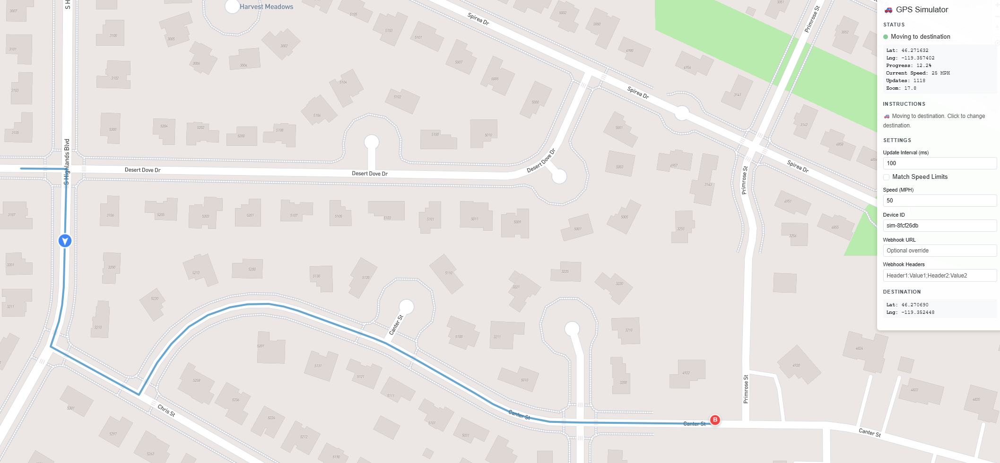

ru# GPS Simulator (GPSim)

A web-based GPS simulation application using Mapbox for mapping and route visualization. This tool allows you to simulate a driver moving along a route with configurable intervals and send GPS coordinates to an external webhook.



## Features

- **Interactive Map**: Mapbox GL JS integration for route planning
- **Automatic Location Detection**: Map centers on your current location on startup (with browser permission)
- **Route Planning**: Click anywhere to set a destination, automatic route calculation via Mapbox Directions API
- **Continuous GPS Simulation**: Automatically sends GPS updates whether stationary or moving
- **Real-time Updates**: Smooth marker animation along the route with bearing indicators
- **Speed Limit Matching**: Option to simulate driving at posted speed limits (where available)
- **Webhook Integration**: Send GPS coordinates to external services at configurable intervals
- **Configurable Settings**:
  - Update interval (100ms - 10000ms)
  - Simulated driving speed (MPH)
  - Speed limit matching mode
  - Custom device ID
  - Optional webhook URL and headers override
- **Visual Feedback**: Displays current position, zoom level, speed, and update count in real-time

## Prerequisites

- .NET 9.0 SDK (for local development)
- Docker (for containerized deployment)
- A Mapbox access token (get one at https://account.mapbox.com/)

## Quick Start with Docker

The easiest way to run GPSim is with Docker:

```bash
# 1. Clone the repository
git clone https://github.com/busadave13/GPSim.git
cd GPSim

# 2. Copy environment template and add your Mapbox token
cp .env.example .env
# Edit .env and set MAPBOX_ACCESS_TOKEN=your_token_here

# 3. Build and run
docker compose up --build

# 4. Open browser
# Navigate to http://localhost:4000
```

### Docker Commands

```bash
# Run in background (detached mode)
docker compose up -d

# View logs
docker compose logs -f

# Stop the container
docker compose down

# Rebuild after code changes
docker compose up --build
```

## Configuration

Update `src/GPSim.Server/appsettings.json` with your settings:

```json
{
  "Mapbox": {
    "AccessToken": "YOUR_MAPBOX_ACCESS_TOKEN"
  },
  "Webhook": {
    "DefaultUrl": "https://your-webhook-endpoint.com/gps",
    "TimeoutSeconds": 30,
    "RetryCount": 3
  },
  "OpenTelemetry": {
    "ServiceName": "GPSim.Server",
    "OtlpEndpoint": "http://localhost:4317",
    "Protocol": "grpc"
  }
}
```

## OpenTelemetry

GPSim includes built-in OpenTelemetry support for distributed tracing. This provides observability into webhook calls and API requests.

### Features

- **Automatic HTTP Tracing**: All incoming API requests and outgoing webhook calls are automatically traced
- **Custom Webhook Spans**: Webhook forwarding includes detailed span attributes:
  - `webhook.url` - Target webhook URL
  - `gps.latitude` / `gps.longitude` - GPS coordinates
  - `gps.speed` / `gps.bearing` - Movement data
  - `http.status_code` - Response status
  - `webhook.success` - Success/failure indicator
- **Flexible Export**: Console exporter for development, OTLP for production

### Configuration

| Setting | Description |
|---------|-------------|
| `OpenTelemetry:ServiceName` | Service name in traces (default: `GPSim.Server`) |
| `OpenTelemetry:OtlpEndpoint` | OTLP collector endpoint (e.g., `http://localhost:4317` for gRPC) |
| `OpenTelemetry:Protocol` | Transport protocol: `grpc` (default) or `http` |

### Docker with Jaeger

To use OpenTelemetry with Jaeger, add to your `docker-compose.yml`:

```yaml
services:
  jaeger:
    image: jaegertracing/all-in-one:latest
    ports:
      - "16686:16686"  # Jaeger UI
      - "4317:4317"    # OTLP gRPC
    environment:
      - COLLECTOR_OTLP_ENABLED=true

  gpsim:
    # ... existing config ...
    environment:
      - OpenTelemetry__OtlpEndpoint=http://jaeger:4317
```

Then view traces at `http://localhost:16686`.

## Running the Application

1. **Restore packages and build:**
   ```bash
   dotnet restore
   dotnet build
   ```

2. **Run the server:**
   ```bash
   cd src/GPSim.Server
   dotnet run
   ```

3. **Open browser:** Navigate to `https://localhost:5001` or `http://localhost:5000`

## Usage

1. **Initial Setup**:
   - When the app loads, it will request your browser's location permission
   - If granted, the map centers on your current location
   - A radius circle is drawn around your position
   - GPS updates begin sending immediately (stationary mode)

2. **Set Destination**:
   - Click anywhere on the map to set a destination
   - A route is automatically calculated from your current position
   - The simulated driver begins moving along the route

3. **Configure Settings**:
   - **Update Interval**: How often GPS data is sent (100ms - 10000ms)
   - **Match Speed Limits**: Toggle to use posted speed limits when available
   - **Speed (MPH)**: Set driving speed (or fallback speed when speed limits unavailable)
   - **Device ID**: Customize the device identifier in GPS payloads
   - **Webhook URL**: Optionally override the server-configured webhook
   - **Webhook Headers**: Add custom headers (format: `Header1:Value1;Header2:Value2`)

4. **Monitor Status**:
   - View current latitude/longitude coordinates
   - See simulation progress percentage when moving
   - Monitor current speed and speed limit (when available)
   - Track total GPS updates sent
   - View current map zoom level

## GPS Payload Format

The webhook receives JSON payloads in the following format:

```json
{
  "deviceId": "sim-abc12345",
  "latitude": 37.7749,
  "longitude": -122.4194,
  "altitude": 0,
  "speed": 12.5,
  "bearing": 180.0,
  "accuracy": 5.0,
  "timestamp": "2025-11-26T20:00:00Z",
  "sequenceNumber": 42
}
```

## Project Structure

```
GPSim/
├── src/
│   ├── GPSim.Shared/        # Shared models
│   ├── GPSim.Client/        # Blazor WASM client
│   │   ├── Pages/           # Razor pages
│   │   ├── Services/        # Client services
│   │   └── wwwroot/         # Static assets & JS interop
│   └── GPSim.Server/        # ASP.NET Core server
│       ├── Controllers/     # API endpoints
│       ├── Services/        # Business logic
│       └── Configuration/   # Settings classes
├── .docs/
│   └── design.md           # Design document
└── GPSim.sln               # Solution file
```

## API Endpoints

| Endpoint | Method | Description |
|----------|--------|-------------|
| `/api/configuration/mapbox` | GET | Get Mapbox access token |
| `/api/webhook/broadcast` | POST | Forward GPS payload to webhook |
| `/api/routes` | GET/POST | Save/load simulation routes |

## License

MIT
